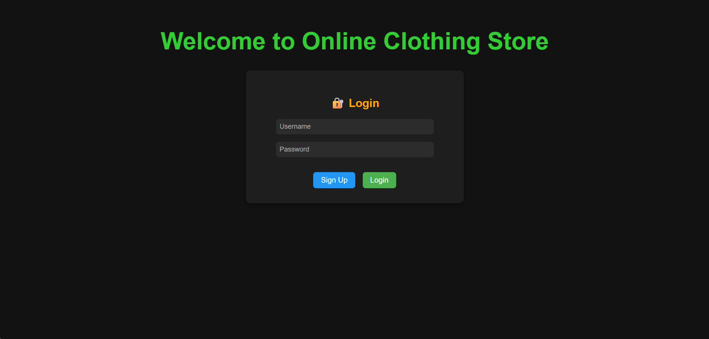
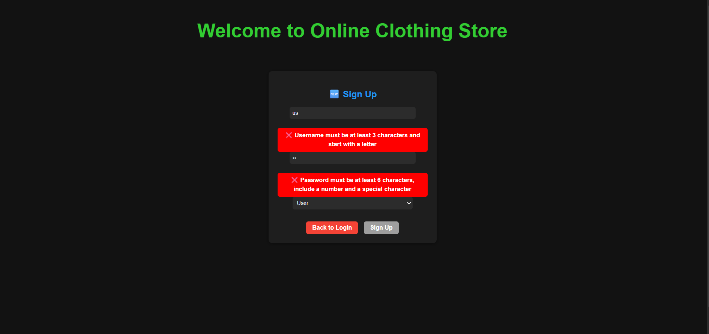
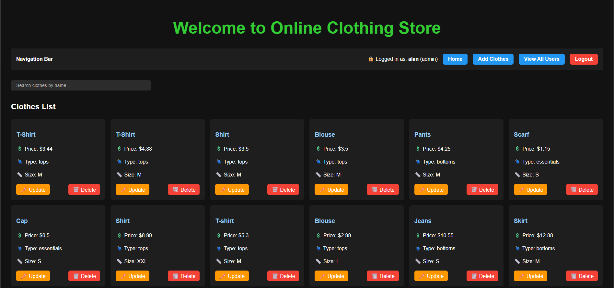
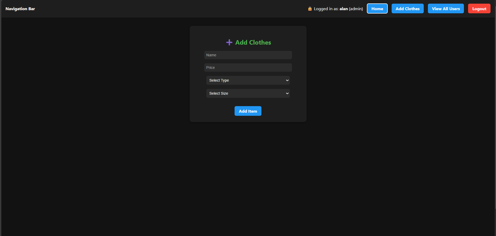
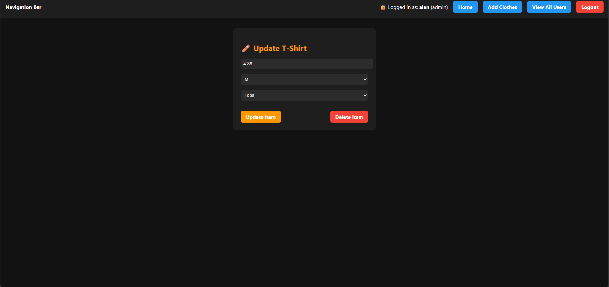
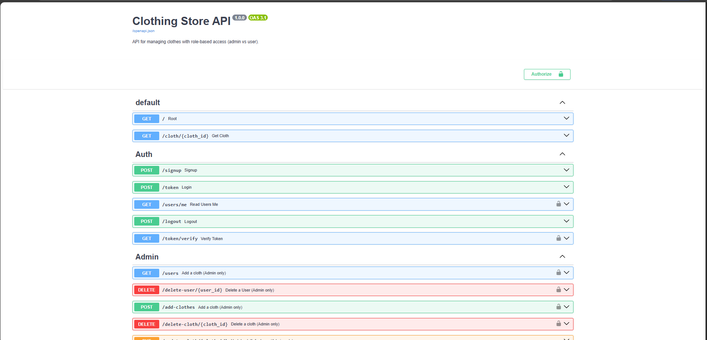

# 👕 Clothing Store Management System
A full‑stack web application for managing clothing inventory with **role‑based access control** (admin vs user). Built using **FastAPI** (backend) and **React + TypeScript** (frontend)

---
## 📖 Summary
This project demonstrates:
- **Secure authentication** with JWT.
- **Role‑based access control** (admin vs user).
- **CRUD operations** for clothing inventory.
- **Session persistence** across page refreshes.
- **Clean frontend state management** with centralized delete logic.

---

## 🚀 Tech Stack

**Frontend**
- Vite ⚡ + React + TypeScript
- Semantic UI mapping with emoji, color-coded categories
- Responsive card layout with search bar and welcome message

---

## 🚀 Features Implemented

### Authentication & Authorization
- **Signup** (`/signup`) – Register new users with username, password, and role.
- **Login** (`/token`) – Issue JWT access tokens for authenticated users.
- **Token Verification** (`/token/verify`) – Restore session state after page refresh.
- **Logout** – Handled on frontend by clearing token.
- **Role Enforcement** – Admin‑only routes protected via `Depends(admin_required)`.

### User Management (Admin Only)
- **List All Users** (`/users`) – View all registered users.
- **Delete User** (`/delete-user/{user_id}`) – Admin can delete other users (not themselves).

### Clothes Management
- **Add Clothes** (`/add-clothes`) – Admin can add new clothing items.
- **View Clothes**
    - `/clothes` – List all clothes.
    - `/cloth/{cloth_id}` – View a single cloth by ID.
- **Update Clothes** (`/update-cloth/{cloth_id}`) – Admin can update price, size, type.
- **Delete Clothes** (`/delete-cloth/{cloth_id}`) – Soft delete (mark inactive).

---

## 🛠️ Backend Implementation

### Tech Stack
- **FastAPI** – Web framework
- **SQLAlchemy** – ORM
- **Passlib** – Password hashing
- **Python‑Jose** – JWT handling
- **CORS Middleware** – Allow frontend requests

---

## 🎨 Frontend Implementation

### Tech Stack
- **React + TypeScript**
- **Axios** – API calls
- **React Router** – Navigation
- **LocalStorage** – Token persistence

### Components
- **Navbar** – Displays username, role, and logout button.
- **Login / Signup** – Authentication forms.
- **AddClothes** – Admin form to add new clothing items.
- **UpdateCloth** – Admin form to update or delete items.
- **ViewAllUsers** – Admin table to manage users.

---

## 📦 Features

- 🔍 Searchable clothes list with semantic tags
- 🧵 Category-based filtering (e.g., 👕 Shirts, 👖 Pants, 🧥 Jackets)
- 🧠 Backend API with secure endpoints and dependency injection
- 🛡️ Auth system with hashed passwords and JWT tokens
- 📊 Swagger docs with role-based visibility

## 🧱 Web App Images

#### Frontend
1. Login screen
   
2. SignUp screen
   
3. Home screen
   
4. Add Clothes screen
   
5. Update Clothes screen
   

#### Backend
1. Backend Methods: GET, POST, DELETE, PUT
   
 
---

### 🌐 API Documentation
* Visit http://localhost:8000/docs for interactive Swagger UI.

### 🧪 Testing
* Backend: pytest
* Frontend: vitest + @testing-library/react

---

### Future Enhancements

* Deploy as a web app in azure
* Alembic migrations
* upgrade to PostgreSQL

---

### Author
* Built by Alan Philip
* Last Update: 20 - Feb - 2026
