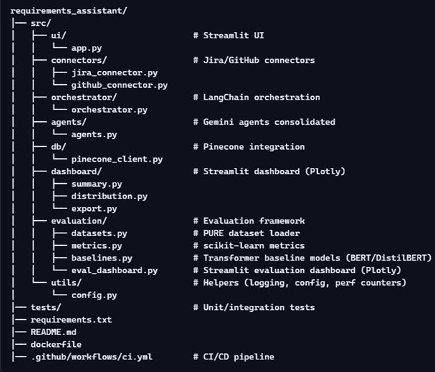

# Requirements Engineering Assistant

A modular, agentic AI assistant for automating requirements engineering tasks.  

This project integrates **Streamlit UI**, **Jira/GitHub connectors**, **LangChain orchestration**, **Gemini agents**, and **Pinecone vector DB**, with an evaluation framework comparing manual vs agentic runs on benchmark datasets.

---

## 🚀 Features

- **Streamlit UI**: Interactive interface for selecting data sources and running pipelines.
- **Data Source Connectors**: Fetch requirements/issues from Jira and GitHub repositories.
- **LangChain Orchestrator**: Routes tasks through Gemini agents for extraction, risk analysis, and design advice.
- **Gemini Agents**:
    - Extractor → identifies requirements
    - Risk Analyzer → flags potential risks
    - Design Advisor → suggests improvements
- **Pinecone Vector DB**: Stores embeddings of requirements and analysis results for retrieval and visualization.
- **Dashboard (Plotly)**: Summary, distribution, and export of processed requirements.
- **Evaluation Framework**:
    - Benchmark with **PURE dataset**
    - Compare **manual vs agentic runs**
    - Metrics: accuracy, risks flagged, time saved
    - Transformer baselines (BERT/DistilBERT) for comparison
    - Streamlit evaluation dashboard with Plotly charts

---

## 📂 Project Structure


---

## 🛠 Tech Stack

- **Frontend/UI**: Streamlit + Plotly
- **Connectors**: Atlassian Python API (Jira), PyGithub
- **Orchestration**: LangChain
- **Agents**: Gemini API (Extractor, Risk Analyzer, Design Advisor)
- **Database**: Pinecone
- **Evaluation**: PURE dataset, scikit-learn, Hugging Face Transformers (BERT/DistilBERT)
- **Deployment**: Docker, Azure App Service, GitHub Actions

---

## 📊 Evaluation Framework

- **Manual baseline**: human annotations or scripted baseline
- **Agentic run**: Gemini agents pipeline
- **Transformer baseline**: BERT/DistilBERT classifiers
- **Metrics**:
    - Accuracy
    - Precision/Recall for risks flagged
    - Time saved (perf counters)
- **Visualization**: Streamlit + Plotly dashboard

---

## ⚡ Getting Started

1. **Clone the repo**:
   ```bash
   git clone https://github.com/your-username/requirements_assistant.git
   cd requirements_assistant

2. **Install dependencies**:
   ```bash
   pip install -r requirements.txt

3. **Run Streamlit UI:**:
   ```bash
   streamlit run src/ui/app.py

---

## 🧪 Testing
1. **Run unit and integration tests:**:
   ```bash
   streamlit run src/ui/app.py

---

## 📈 Roadmap
- Implement Jira/GitHub connectors
- Build Streamlit UI skeleton
- Add Gemini agents orchestration
- Integrate Pinecone storage
- Develop recruiter-facing dashboard
- Implement PURE dataset evaluation
- Add transformer baselines
- Deploy via Docker + Azure