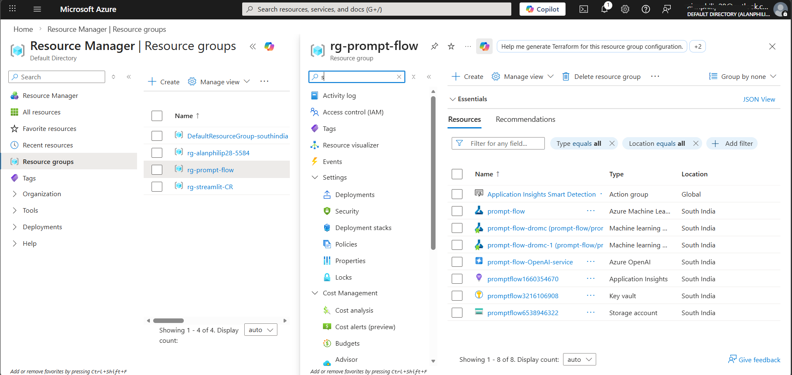
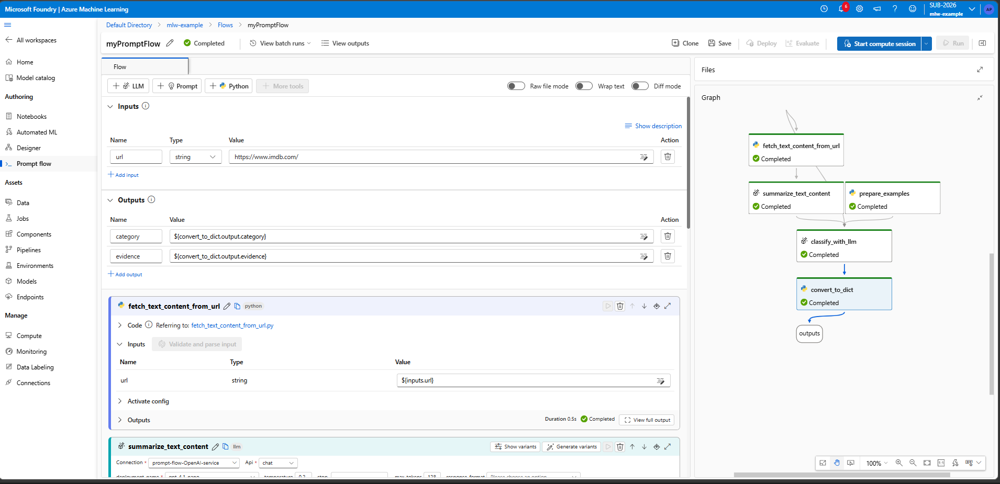
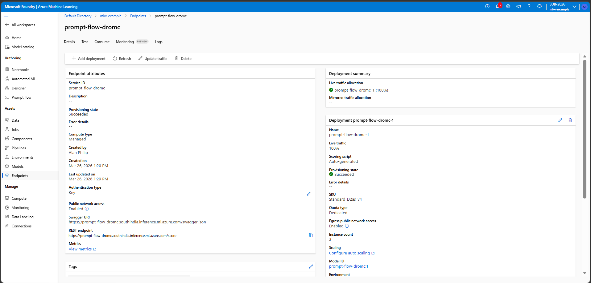

# Azure ML Prompt Flow - Web Classification

## Overview
This project demonstrates how to build, test, and deploy a **Web Classification Prompt Flow** in Azure Machine Learning Studio using **Azure OpenAI Service**.

The flow fetches text content from a URL, summarizes it, and classifies it into categories using LLM prompts.

---

## Prerequisites
- Azure ML Workspace with default blob storage
- Azure OpenAI resource with a deployed model (e.g., GPT-35, GPT-4)
- Proper IAM role assignments (Storage Blob Data Reader for workspace managed identity)

---

## Steps Completed

### 1. Resource Setup
- Created Azure ML workspace
- Deployed Azure OpenAI service
- Configured connections in ML Studio

### 2. Prompt Flow Creation
- Cloned **Web Classification sample flow**
- Flow components:
    - `fetch_text_content_from_url` (Python node)
    - `summarize_content` (LLM node)
    - `classify_category` (LLM node)

### 3. Testing
- Ran single-node tests
- Ran full flow with sample URLs
- Verified outputs: category + evidence

### 4. Evaluation
- Used `data.csv` golden dataset
- Evaluated accuracy, recall, and relevance
- Exported results for analysis

### 5. Deployment
- Deployed flow as a real-time endpoint
- Tested endpoint with sample URLs
- Endpoint returned predicted categories successfully

---

## 📸 Screenshots

---

## Common Issues & Fixes
- **401 Unauthorized Error**: Ensure workspace/registry managed identity has **Storage Blob Data Reader** access to source storage account.
- Wait ~10 minutes for role assignments to propagate after creation.

---

## Next Steps
- Extend classification categories
- Integrate with external datasets
- Automate evaluation pipeline

---

## References
- [Microsoft Learn: Get Started with Prompt Flow](https://learn.microsoft.com/en-us/azure/machine-learning/prompt-flow/get-started-prompt-flow?view=azureml-api-2)
